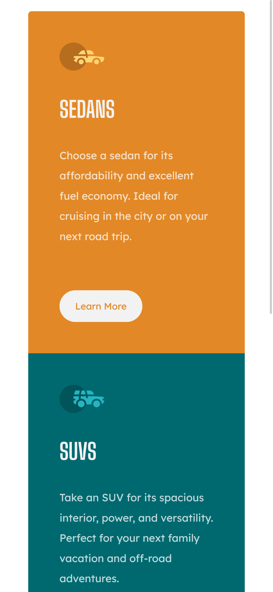
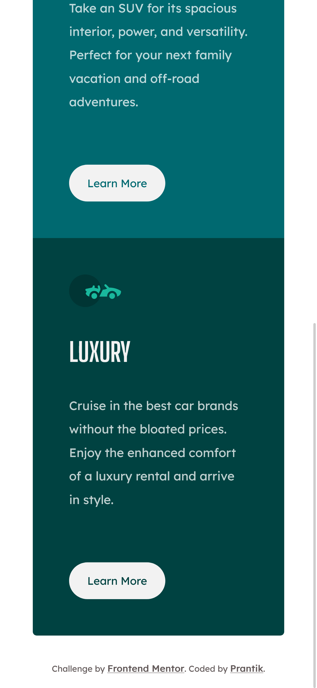
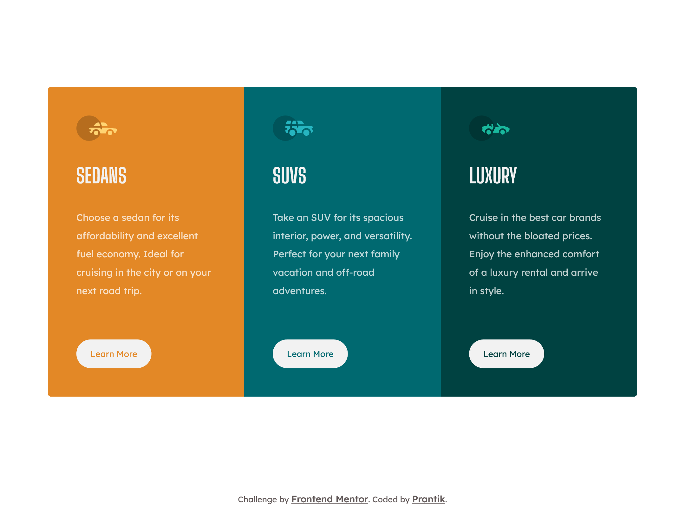

# Frontend Mentor - 3-column preview card component solution

This is a solution to the [3-column preview card component challenge on Frontend Mentor](https://www.frontendmentor.io/challenges/3column-preview-card-component-pH92eAR2-). Frontend Mentor challenges help you improve your coding skills by building realistic projects. 

## Table of contents

- [Overview](#overview)
  - [The challenge](#the-challenge)
  - [Screenshot](#screenshot)
  - [Links](#links)
- [My process](#my-process)
  - [Built with](#built-with)
  - [What I learned](#what-i-learned)
  - [Continued development](#continued-development)
- [Author](#author)
- [Acknowledgments](#acknowledgments)


## Overview

### The challenge

Users should be able to:

- View the optimal layout depending on their device's screen size
- See hover states for interactive elements

### Screenshot

 




<!-- ### Links

- Solution URL: [Add solution URL here](https://your-solution-url.com)
- Live Site URL: [Add live site URL here](https://your-live-site-url.com) -->

## My process

### Built with

- Semantic HTML5 markup
- CSS variables
- CSS Flexbox
- Desktop-first workflow


### What I learned

By doing this project, I learned more about Responsive design.

I used `nth-of-type` seoudo selector

```css
.card > .column:nth-of-type(1) {
  background-color: var(--color-bright-orange);
  border-radius: var(--border-radius-card) 0 0 var(--border-radius-card);
}
```

### Continued development

I have to learn more about responsive design and best practices.

## Author

- Frontend Mentor - [@prantiknoor](https://www.frontendmentor.io/profile/prantiknoor)
- Twitter - [@prantiknoor](https://www.twitter.com/prantiknoor)


## Acknowledgments

Thanks to everyone who helped me learn code.