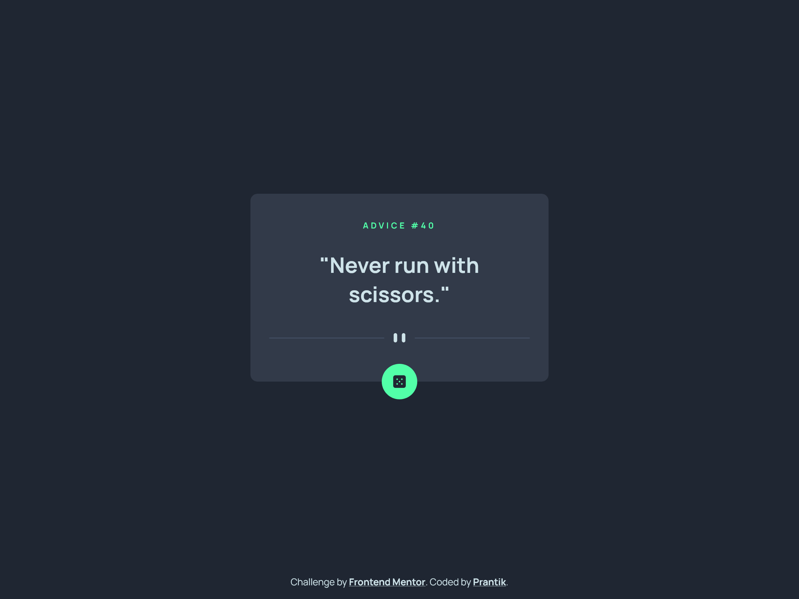
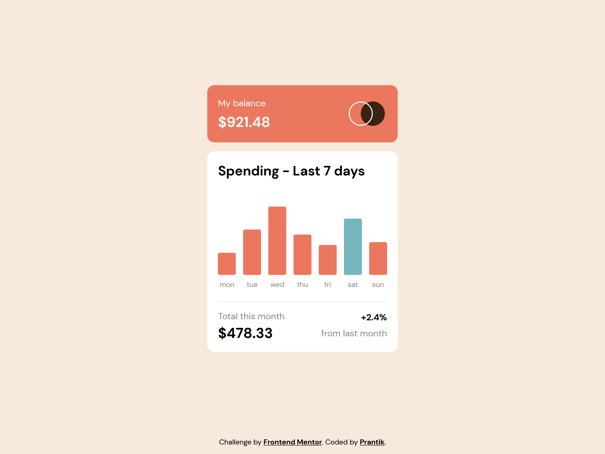
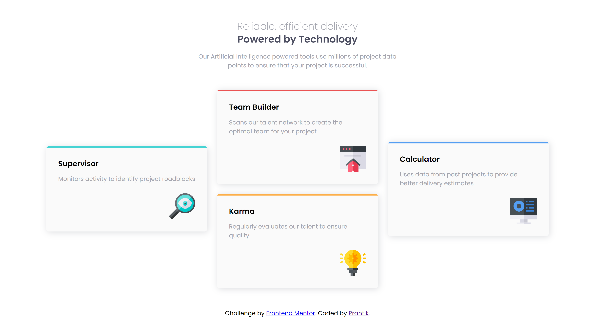

# My solutions of [Frontend Mentor's Challenges](https://www.frontendmentor.io/challenges).

## 1. [Responsive Space tourism multipage website](https://frontend-mentor-challenges-prantik.netlify.app/space-tourism-website/)

## 2. [Responsive Intro section with dropdown navigation](https://frontend-mentor-challenges-prantik.netlify.app/intro-section-with-dropdown-navigation/)

## 3. [Responsive Tip calculator app](https://frontend-mentor-challenges-prantik.netlify.app/tip-calculator-app/)

## 4. [Advice generator app with vanilla JavaScript](https://frontend-mentor-challenges-prantik.netlify.app/advice-generator-app/)

## 5. [Responsive Social proof section](https://frontend-mentor-challenges-prantik.netlify.app/social-proof-section/)

## 6. [Dynamic expenses chart component solution](https://frontend-mentor-challenges-prantik.netlify.app/expenses-chart-component/)

## 7. [NFT preview card component by pure HTML & CSS](https://frontend-mentor-challenges-prantik.netlify.app/nft-preview-card-component-main)

## 8. [Product preview card component using CSS Flexbox](https://frontend-mentor-challenges-prantik.netlify.app/product-preview-card-component)

## 9. [Interactive rating component](https://frontend-mentor-challenges-prantik.netlify.app/interactive-rating-component)

## 10. [Responsive 3-column preview card component](https://frontend-mentor-challenges-prantik.netlify.app/3-column-preview-card-component)

## 11. [Four card feature section solution using Grid](https://frontend-mentor-challenges-prantik.netlify.app/four-card-feature-section/)

