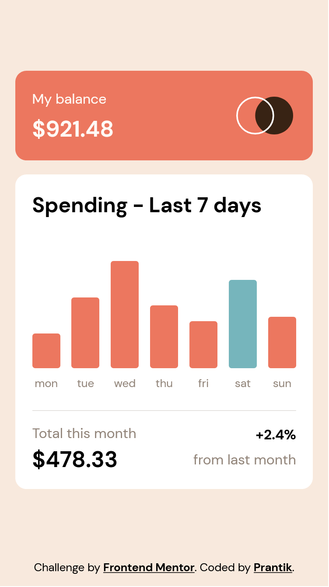

# Frontend Mentor - Expenses chart component solution

This is a solution to the [Expenses chart component challenge on Frontend Mentor](https://www.frontendmentor.io/challenges/expenses-chart-component-e7yJBUdjwt). Frontend Mentor challenges help you improve us coding skills by building realistic projects.

## Table of contents

- [Overview](#overview)
  - [The challenge](#the-challenge)
  - [Screenshot](#screenshot)
  - [Links](#links)
- [My process](#my-process)
  - [Built with](#built-with)
  - [What I learned](#what-i-learned)
  - [Continued development](#continued-development)
  - [Useful resources](#useful-resources)
- [Author](#author)
- [Acknowledgments](#acknowledgments)

## Overview

### The challenge

Users should be able to:

- View the bar chart and hover over the individual bars to see the correct amounts for each day
- See the current day’s bar highlighted in a different colour to the other bars
- View the optimal layout for the content depending on their device’s screen size
- See hover states for all interactive elements on the page
- **Bonus**: Use the JSON data file provided to dynamically size the bars on the chart

### Screenshot



### Links

- Solution URL: [GitHub](https://github.com/prantiknoor/frontend-mentor-challenges/tree/master/expenses-chart-component)
- Live Site URL: [Vercel](https://expenses-chart-component-prantiknoor.vercel.app), [Netlify](https://frontend-mentor-challenges-prantik.netlify.app/expenses-chart-component/)

## My process

### Built with

- Semantic HTML5 markup
- CSS custom properties
- Flexbox
- CSS Grid
- Mobile-first workflow

### What I learned

I used `BEM` _(Body Element Modifier)_ in this project. It is the second project where I used `BEM`.

```html
<header class="header">
  <span class="header__label">My balance</span>
  <span class="header__value">$921.48</span>
  <div class="header__logo">
    
  </div>
</header>
```

First time in this project, I worked with dynamic data. I used pseudo selectors for `tooltip` & `day`. But I couldn't change those content in my script. So I had to switch on regular `div`;

To see how you can add code snippets, see below:

```css
/* I used .chart__bar::after earlier */
.tooltip {
    color: #fff;
    background-color: #151515;
    font-size: 0.8rem;
    font-weight: bold;
    border-radius: 0.2rem;
    position: absolute;
    top: -1.9rem;
    left: 50%;
    transform: translate(-50%, 0);
    padding: 0.25rem;
    visibility: hidden;
    opacity: 0;
    transition: opacity .6s ease 0s;
}
```
I used `XMLHttpRequest()` to import json data.
```js
function fetchData(url) {
  const xmlHttp = new XMLHttpRequest();
  xmlHttp.open("GET", url, false);
  xmlHttp.send(null);
  return { data: JSON.parse(xmlHttp.responseText) };
}
```


### Continued development

By working on this project, I realized I have to practice more. 

### Useful resources

- [JavaScript Algorithms and Data Structures](https://www.freecodecamp.org/learn/javascript-algorithms-and-data-structures/) - Now, I am doing this course.
- [Responsive Web Design - freeCodeCamp](https://www.freecodecamp.org/learn/2022/responsive-web-design/) - This is an amazing course which helped me finally understand HTML & CSS very well. I'd recommend it to anyone new in web development

## Author

- Frontend Mentor - [@prantiknoor](https://www.frontendmentor.io/profile/prantiknoor)
- Twitter - [@prantiknoor](https://www.twitter.com/prantiknoor)
- CodePen - [@prantiknoor](https://codepen.io/prantiknoor)

## Acknowledgments

Thanks to everyone who helped me learning code.
