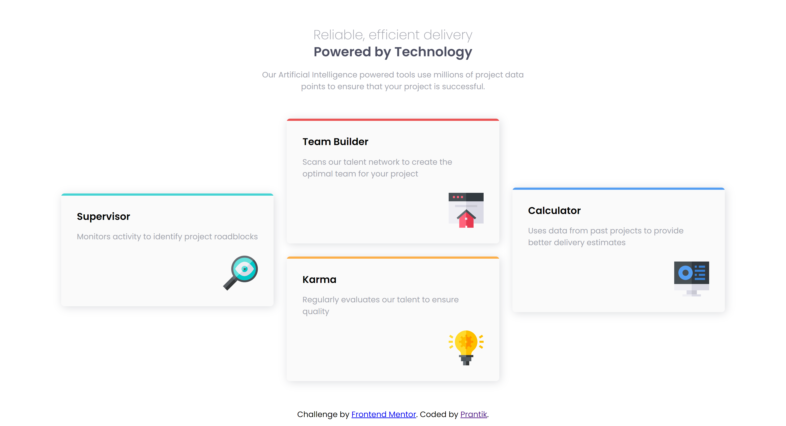
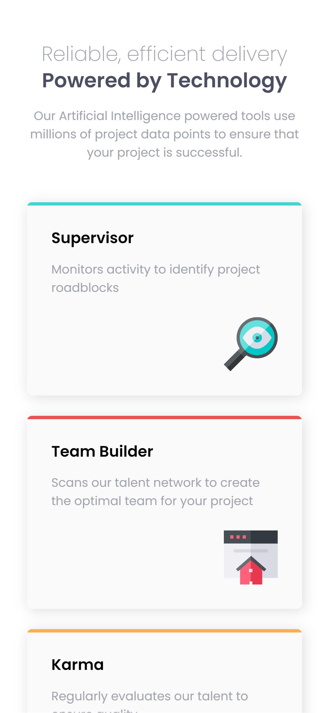
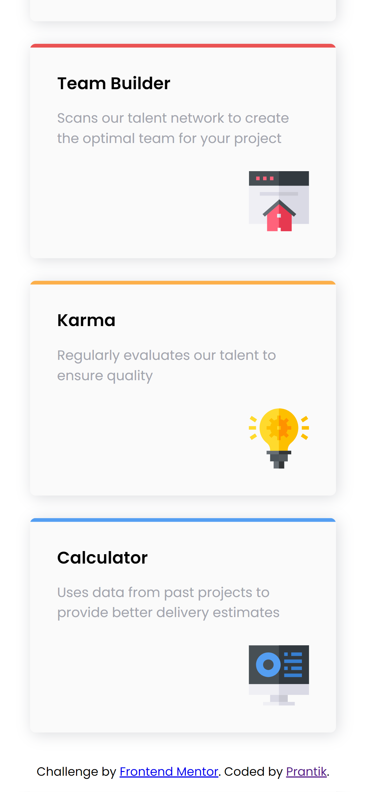

# Frontend Mentor - Four card feature section solution

This is a solution to the [Four card feature section challenge on Frontend Mentor](https://www.frontendmentor.io/challenges/four-card-feature-section-weK1eFYK). Frontend Mentor challenges help you improve your coding skills by building realistic projects. 

## Table of contents

- [Overview](#overview)
  - [The challenge](#the-challenge)
  - [Screenshot](#screenshot)
  - [Links](#links)
- [My process](#my-process)
  - [Built with](#built-with)
  - [What I learned](#what-i-learned)
  - [Continued development](#continued-development)
  - [Useful resources](#useful-resources)
- [Author](#author)
- [Acknowledgments](#acknowledgments)

**Note: Delete this note and update the table of contents based on what sections you keep.**

## Overview

### The challenge

Users should be able to:

- View the optimal layout for the site depending on their device's screen size


### Screenshot


 

### Links

- Solution URL: [GitHub](https://github.com/prantiknoor/frontend-mentor-challenges/tree/master/four-card-feature-section)
- Live Site URL: [Netlify](https://frontend-mentor-challenges-prantik.netlify.app/four-card-feature-section/)

## My process

### Built with

- Semantic HTML5 markup
- CSS custom properties
- Flexbox
- CSS Grid
- Desktop-first workflow


### What I learned

Recenty I completed **Design System** course by @kevin-powell in scrimba. Where I learned many many important things. So I tried to implement those.

I did reset some default CSS rules.
```css
/* ------------------- */
/* CSS Reset           */
/* ------------------- */

/* Box sizing rules */
*,
*::before,
*::after {
  box-sizing: border-box;
}

/* Remove default margin */
body,
h1,
h2,
h3,
h4,
p {
  margin: 0;
}

body {
    font-family: var(--ff-sans-serif);
}

/* Set core body defaults */
body {
  min-height: 100vh;
  text-rendering: optimizeSpeed;
  line-height: 1.5;
}

/* Make image easier to work with */
img,
picture {
  max-width: 100%;
  display: block;
}
```

I used `CSS custom properties`.
```css
/* -------------------- */
/* Custom properties    */
/* -------------------- */

:root {
  /* colors */
  --clr-dark: 234 12% 34%;
  --clr-gray: 229 6% 66%;
  --clr-light: 0 0% 98%;
  --clr-red: 0 78% 62%;
  --clr-cyan: 180 62% 55%;
  --clr-orange: 34 97% 64%;
  --clr-blue: 212 86% 64%;

  /* font-families */
  --ff-sans-serif: "Poppins", sans-serif;

  /* font-sizes */
  --fs-600: 2rem;
  --fs-500: 1.5rem;
  --fs-400: 1.125rem;
  --fs-300: 0.9rem;
}
```

I also coded some `utility classes`.
```css
/* -------------------- */
/* Utility classes      */
/* -------------------- */

.flex {
  display: flex;
  gap: var(--gap, 1rem);
}

.grid {
  display: grid;
  gap: var(--gap, 1rem);
}

.container {
  max-width: 80rem;
  margin-inline: auto;
  padding-inline: 2em;
}

.sr-only {
  position: absolute;
  width: 1px;
  height: 1px;
  margin: -1px;
  padding: 0;
  overflow: hidden;
  clip: rect(0, 0, 0, 0);
  white-space: nowrap;
  border: 0;
}

.text-dark { color: hsl(var(--clr-dark)); }
.text-gray { color: hsl(var(--clr-gray)); }
.bg-light { background-color: hsl(var(--clr-light)); }

.ff-sans-serif { font-family: var(--ff-sans-serif); }

.fs-300 { font-size: var(--fs-300); }
.fs-400 { font-size: var(--fs-400); }
.fs-500 { font-size: var(--fs-500); }
.fs-600 { font-size: var(--fs-600); }

.text-center { text-align: center; }
```

### Continued development

By doing this project, I found my knowledge lackings in javascript. I should focus on javascript.


### Useful resources
- [Build a space travel website](https://scrimba.com/learn/spacetravel) - Bring a Frontend Mentor design to life and create your own design system while building a multi-page space travel website with Kevin Powell as your guide.
- [Responsive Web Design - freeCodeCamp](https://www.freecodecamp.org/learn/2022/responsive-web-design/) - This is an amazing course which helped me finally understand HTML & CSS very well. I'd recommend it to anyone new in web development


## Author

- Frontend Mentor - [@prantiknoor](https://www.frontendmentor.io/profile/prantiknoor)
- Twitter - [@prantiknoor](https://www.twitter.com/prantiknoor)
- CodePen - [@prantiknoor](https://codepen.io/prantiknoor)


## Acknowledgments

Thanks to everyone who helped me learning code.