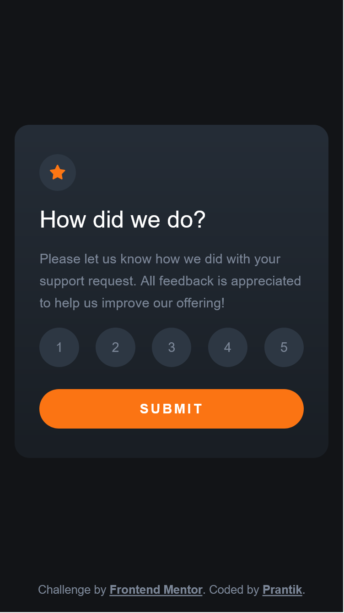

# Frontend Mentor - Interactive rating component solution

This is a solution to the [Interactive rating component challenge on Frontend Mentor](https://www.frontendmentor.io/challenges/interactive-rating-component-koxpeBUmI). Frontend Mentor challenges help you improve your coding skills by building realistic projects.

## Table of contents

- [Overview](#overview)
  - [The challenge](#the-challenge)
  - [Screenshot](#screenshot)
  - [Links](#links)
- [My process](#my-process)
  - [Built with](#built-with)
  - [What I learned](#what-i-learned)
  - [Continued development](#continued-development)
  - [Useful resources](#useful-resources)
- [Author](#author)
- [Acknowledgments](#acknowledgments)

## Overview

### The challenge

Users should be able to:

- View the optimal layout for the app depending on their device's screen size
- See hover states for all interactive elements on the page
- Select and submit a number rating
- See the "Thank you" card state after submitting a rating

### Screenshot

 


### Links

- Solution URL: [GitHub](https://github.com/prantiknoor/frontend-mentor-challenges/tree/master/interactive-rating-component)
- Live Site URL: [Vercel](https://interactive-rating-component-prantiknoor.vercel.app), [Netlify](https://frontend-mentor-challenges-prantik.netlify.app/interactive-rating-component/)

## My process

### Built with

- Semantic HTML5 markup
- CSS variables
- Flexbox
- CSS Grid
- CSS Flexbox
- Mobile-first workflow


### What I learned

It is the first frontendmentor challenge where I wrote js code.

I added `script` as the first child of body. That was not working. After some research, I have added `script` at the bottom of body. Now it's working.

I added external script:

```html
<script type="text/javascript" src="script.js"></script>
```

First time, I used `setAttribute` method & added more class using `classList.add()`:

```js
ratingCard.setAttribute('hidden', true)
thankYouCard.classList.add("card--thank-you-state");
```


### Continued development

By doing this project, I found my knowledge lackings in javascript. I should focus on javascript.


### Useful resources

- [JavaScript Algorithms and Data Structures](https://www.freecodecamp.org/learn/javascript-algorithms-and-data-structures/) - Now, I am doing this course.
- [Responsive Web Design - freeCodeCamp](https://www.freecodecamp.org/learn/2022/responsive-web-design/) - This is an amazing course which helped me finally understand HTML & CSS very well. I'd recommend it to anyone new in web development


## Author

- Frontend Mentor - [@prantiknoor](https://www.frontendmentor.io/profile/prantiknoor)
- Twitter - [@prantiknoor](https://www.twitter.com/prantiknoor)
- CodePen - [@prantiknoor](https://codepen.io/prantiknoor)


## Acknowledgments

Thanks to everyone who helped me learning code.
