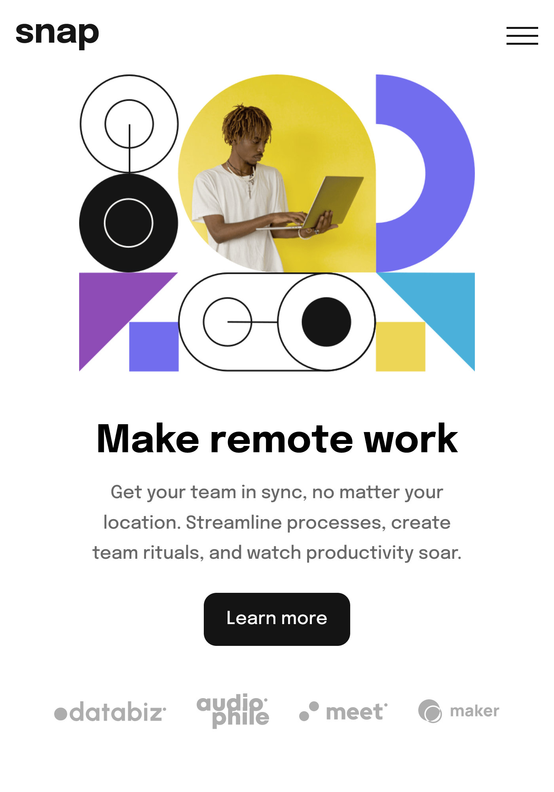

# Frontend Mentor - Intro section with dropdown navigation solution

This is a solution to the [Intro section with dropdown navigation challenge on Frontend Mentor](https://www.frontendmentor.io/challenges/intro-section-with-dropdown-navigation-ryaPetHE5). Frontend Mentor challenges help you improve your coding skills by building realistic projects. 

## Table of contents

- [Overview](#overview)
  - [The challenge](#the-challenge)
  - [Screenshot](#screenshot)
  - [Links](#links)
- [My process](#my-process)
  - [Built with](#built-with)
  - [What I learned](#what-i-learned)
  - [Continued development](#continued-development)
  - [Useful resources](#useful-resources)
- [Author](#author)
- [Acknowledgments](#acknowledgments)

**Note: Delete this note and update the table of contents based on what sections you keep.**

## Overview

### The challenge

Users should be able to:

- View the relevant dropdown menus on desktop and mobile when interacting with the navigation links
- View the optimal layout for the content depending on their device's screen size
- See hover states for all interactive elements on the page

### Screenshot

> Tablet & Mobile Screenshots

 " "

> Dekstop screenshots

### Links

- Solution URL: [GitHub](https://github.com/prantiknoor/frontend-mentor-challenges/tree/master/intro-section-with-dropdown-navigation)
- Live Site URL: [Netlify](https://frontend-mentor-challenges-prantik.netlify.app/intro-section-with-dropdown-navigation/)

## My process

### Built with

- Semantic HTML5 markup
- CSS custom properties
- Flexbox
- CSS Grid
- Vanilla JavaScript
- Mobile-first workflow

### What I learned

The important challenges was **Responsivness**, **Dropdown** & **Navbar**. Recently I completed a course called [Build a space travel website](https://scrimba.com/learn/spacetravel) by *Kevin Powell* in *Scrimba*. Where I learned all of these. I have practiced those concepts & knowledge. Although I have changed many properties/values, added new.

I also used a browser extention to make my site **Pixel Perfect**.

### Continued development

- Responsive Design
- Accessibility

### Useful resources
- [Build a space travel website](https://scrimba.com/learn/spacetravel) - Bring a Frontend Mentor design to life and create your own design system while building a multi-page space travel website with Kevin Powell as your guide.
- [Responsive Web Design - freeCodeCamp](https://www.freecodecamp.org/learn/2022/responsive-web-design/) - This is an amazing course which helped me finally understand HTML & CSS very well. I'd recommend it to anyone new in web development

## Author

- Frontend Mentor - [@prantiknoor](https://www.frontendmentor.io/profile/prantiknoor)
- Twitter - [@prantiknoor](https://www.twitter.com/prantiknoor)
- CodePen - [@prantiknoor](https://codepen.io/prantiknoor)

## Acknowledgments

Thanks to everyone who helped me learning code.
