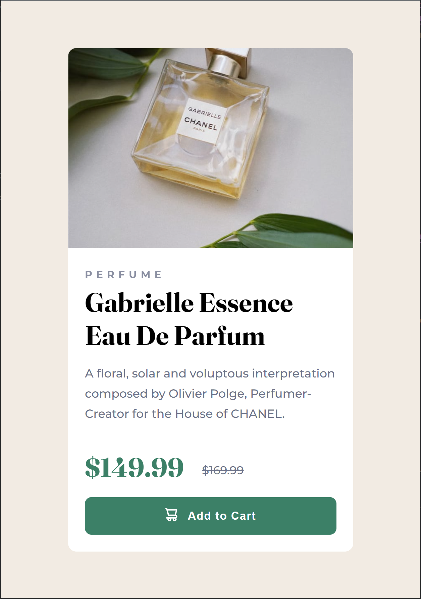
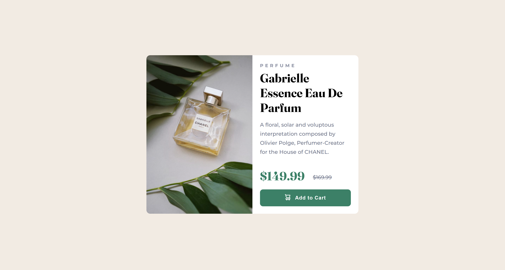

# Frontend Mentor - Product preview card component solution

This is a solution to the [Product preview card component challenge on Frontend Mentor](https://www.frontendmentor.io/challenges/product-preview-card-component-GO7UmttRfa). Frontend Mentor challenges help you improve your coding skills by building realistic projects.

## Table of contents

- [Overview](#overview)
  - [The challenge](#the-challenge)
  - [Screenshot](#screenshot)
  - [Links](#links)
- [My process](#my-process)
  - [Built with](#built-with)
  - [What I learned](#what-i-learned)
- [Author](#author)
- [Acknowledgments](#acknowledgments)

## Overview

### The challenge

Users should be able to:

- View the optimal layout depending on their device's screen size
- See hover and focus states for interactive elements

### Screenshot

 

##

### Links

- Solution URL: [GitHub](https://github.com/prantiknoor/frontend-mentor-challenges/tree/master/product-preview-card-component)
- Live Site URL: [Vercel](https://product-preview-card-component-rho.vercel.app)

## My process

### Built with

- Semantic HTML5 markup
- Pure CSS
- Flexbox
- Mobile-first workflow

### What I learned

By doing this challenge, I have used my knowledge to work. I used CSS variables, CSS flexbox etc.

I learn how to change image based on the screen size using `picture` tag:

```html
<picture>
  <source
    media="(min-width: 800px)"
    srcset="./images/image-product-desktop.jpg"
  />
  
</picture>
```

I added a `svg icon` using CSS pseudo selector.

```css
.add-to-cart::before {
  content: url("./images/icon-cart.svg");
  margin-right: 12px;
}
```

I centered the icon vertically by:
```css
  vertical-align: middle;
```

## Author

- Frontend Mentor - [@prantiknoor](https://www.frontendmentor.io/profile/prantiknoor)
- Twitter - [@prantiknoor](https://www.twitter.com/prantiknoor)

## Acknowledgments

Thank you Frontend Mentor.
