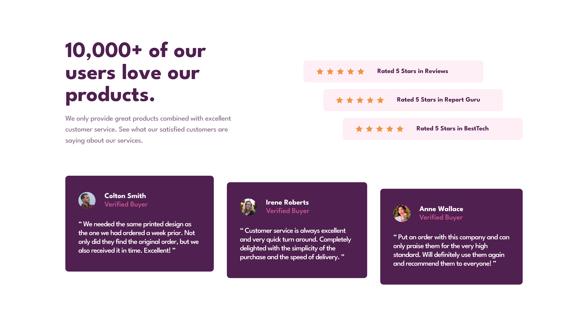

# Frontend Mentor - Social proof section solution

This is a solution to the [Social proof section challenge on Frontend Mentor](https://www.frontendmentor.io/challenges/social-proof-section-6e0qTv_bA). Frontend Mentor challenges help you improve your coding skills by building realistic projects. 

## Table of contents

- [Overview](#overview)
  - [The challenge](#the-challenge)
  - [Screenshot](#screenshot)
  - [Links](#links)
- [My process](#my-process)
  - [Built with](#built-with)
  - [What I learned](#what-i-learned)
  - [Continued development](#continued-development)
  - [Useful resources](#useful-resources)
- [Author](#author)
- [Acknowledgments](#acknowledgments)

**Note: Delete this note and update the table of contents based on what sections you keep.**

## Overview

### The challenge

Users should be able to:

- View the optimal layout for the section depending on their device's screen size

### Screenshot



### Links

- Solution URL: [GitHub](https://github.com/prantiknoor/frontend-mentor-challenges/tree/master/social-proof-section)
- Live Site URL: [Netlify](https://frontend-mentor-challenges-prantik.netlify.app/social-proof-section/)

## My process

### Built with

- Semantic HTML5 markup
- CSS custom properties
- Flexbox
- CSS Grid
- Mobile-first workflow

### What I learned

I learned more about **Responsive Design** and **Pixel Perfect Design**.

I used CSS Custom properties.

```css
:root {
  /* colors */
  --clr-dark: 300 43% 22%;
  --clr-light: 0 0% 100%;
  --clr-accent: 333 80% 67%;

  --clr-s-dark: 303 10% 53%;
  --clr-s-light: 300 24% 96%;

  /* font sizes */
  --fs-800: 2.375rem;
  --fs-500: 1.125rem;
  --fs-400: 1rem;

  /* font families */
  --ff-sans-serif: "League Spartan", sans-serif;
}

@media screen and (min-width: 64rem) {
  :root {
    --fs-800: 3.375rem;
  }
}
```


### Continued development

- Responsive design.
- JavaScript
- Sass

### Useful resources

- [Build a space travel website](https://scrimba.com/learn/spacetravel) - Bring a Frontend Mentor design to life and create your own design system while building a multi-page space travel website with Kevin Powell as your guide.

- [Responsive Web Design - freeCodeCamp](https://www.freecodecamp.org/learn/2022/responsive-web-design/) - This is an amazing course which helped me finally understand HTML & CSS very well. I'd recommend it to anyone new in web development


## Author

- Frontend Mentor - [@prantiknoor](https://www.frontendmentor.io/profile/prantiknoor)
- Twitter - [@prantiknoor](https://www.twitter.com/prantiknoor)
- CodePen - [@prantiknoor](https://codepen.io/prantiknoor)

## Acknowledgments

Thanks to everyone who helped me learning code.