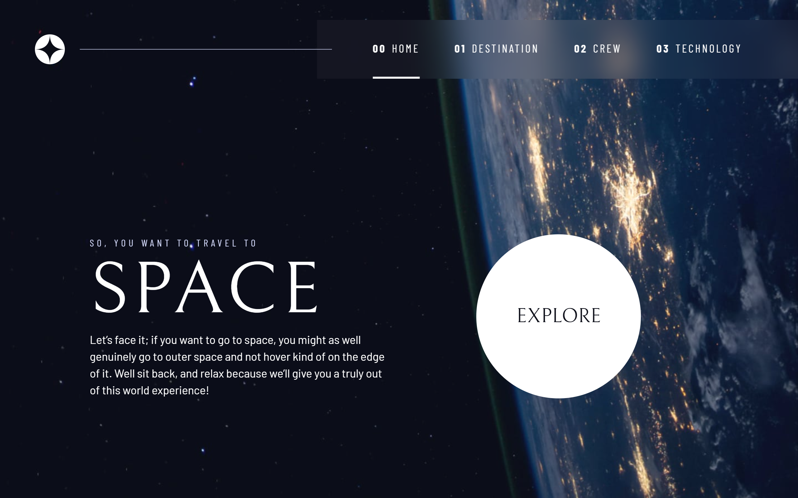

# Frontend Mentor - Space tourism website solution

This is a solution to the [Space tourism website challenge on Frontend Mentor](https://www.frontendmentor.io/challenges/space-tourism-multipage-website-gRWj1URZ3). Frontend Mentor challenges help you improve your coding skills by building realistic projects. 

## Table of contents

- [Overview](#overview)
  - [The challenge](#the-challenge)
  - [Screenshot](#screenshot)
  - [Links](#links)
- [My process](#my-process)
  - [Built with](#built-with)
  - [What I learned](#what-i-learned)
  - [Continued development](#continued-development)
  - [Useful resources](#useful-resources)
- [Author](#author)
- [Acknowledgments](#acknowledgments)

## Overview

### The challenge

Users should be able to:

- View the optimal layout for each of the website's pages depending on their device's screen size
- See hover states for all interactive elements on the page
- View each page and be able to toggle between the tabs to see new information

### Screenshot

> Some Desktop screenshots

> Some mobile screenshots

  

### Links

- Solution URL: [GitHub](https://github.com/prantiknoor/frontend-mentor-challenges/tree/master/space-tourism-website)
- Live Site URL: [Netlify](https://frontend-mentor-challenges-prantik.netlify.app/space-tourism-website/)

## My process

### Built with

- Semantic HTML5 markup
- CSS custom properties
- Flexbox
- CSS Grid
- mobile-first workflow

### What I learned

I made this project as a part of my learning journey. The instructor of [the course](https://scrimba.com/learn/spacetravel) was @Kevin-Powell. I learned many many things. As a summury:

- CSS Design System
- Better use of CSS custom properties
- CSS Reset
- Utility classes
- Mobile first workflow
- Responsive design
- Accessibility
- Code reusing, etc.

The most cool thing is that, tab functionality. (made for one, work for all)

### Continued development

By doing this project, I learn many things, tips. Now I will have to make work these on other project.

### Useful resources
- [Build a space travel website](https://scrimba.com/learn/spacetravel) - Bring a Frontend Mentor design to life and create your own design system while building a multi-page space travel website with Kevin Powell as your guide.
- [Responsive Web Design - freeCodeCamp](https://www.freecodecamp.org/learn/2022/responsive-web-design/) - This is an amazing course which helped me finally understand HTML & CSS very well. I'd recommend it to anyone new in web development

## Author

- Frontend Mentor - [@prantiknoor](https://www.frontendmentor.io/profile/prantiknoor)
- Twitter - [@prantiknoor](https://www.twitter.com/prantiknoor)
- CodePen - [@prantiknoor](https://codepen.io/prantiknoor)

## Acknowledgments

Thanks to everyone who helped me learning code & specially thanks to [Kevin](https://github.com/kevin-powell) & [Scrimba](https://scrimba.com) to having this amazing course.