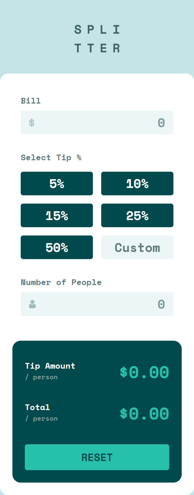
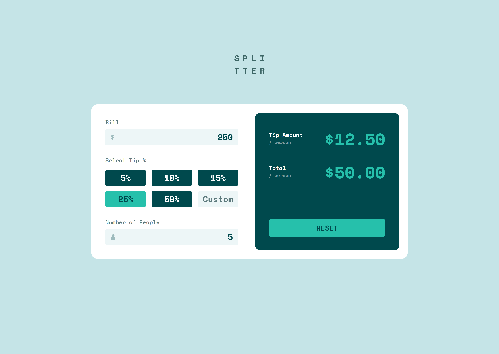
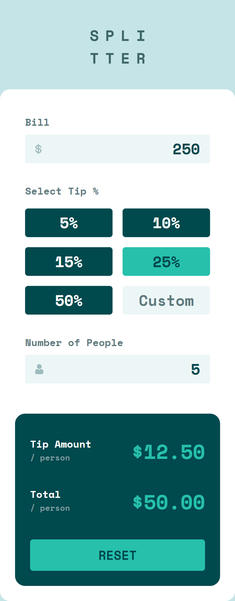

# Frontend Mentor - Tip calculator app solution

This is a solution to the [Tip calculator app challenge on Frontend Mentor](https://www.frontendmentor.io/challenges/tip-calculator-app-ugJNGbJUX). Frontend Mentor challenges help you improve your coding skills by building realistic projects.

## Table of contents

- [Overview](#overview)
  - [The challenge](#the-challenge)
  - [Screenshot](#screenshot)
  - [Links](#links)
- [My process](#my-process)
  - [Built with](#built-with)
  - [What I learned](#what-i-learned)
  - [Continued development](#continued-development)
  - [Useful resources](#useful-resources)
- [Author](#author)
- [Acknowledgments](#acknowledgments)


## Overview

### The challenge

Users should be able to:

- View the optimal layout for the app depending on their device's screen size
- See hover states for all interactive elements on the page
- Calculate the correct tip and total cost of the bill per person

### Screenshot



### Links

- Solution URL: [GitHub](https://github.com/prantiknoor/frontend-mentor-challenges/tree/master/tip-calculator-app)
- Live Site URL: [Netlify](https://frontend-mentor-challenges-prantik.netlify.app/tip-calculator-app/)

## My process

### Built with

- Semantic HTML5 markup
- CSS custom properties
- Flexbox
- CSS Grid
- Vanilla JavaScript
- Mobile-first workflow

### What I learned

I have learned so many things by doing this project.

> HTML
- I used `contenteditable` *attribute* to use take user input.
- Called function on markup. (Ex. `onclick="resetAll()"`)
- Controlled keypress event. `onkeypress="return event.charCode !== 46"`
- by default `input[type="number"]` takes only integer. to take decimal I menupulate `step="1.00"`.
- `tabindex="0" ` used to make *label* keyboard focusable.

> CSS
- To control easily. I used CSS variables:
 ```css 
 .result {
    --padding: 1.5rem;
    --gap: calc(var(--padding) + 0.75rem);
    padding: var(--padding);
    padding-top: var(--gap);
 }

 @media screen and (min-width: 60rem) {
    .result {
      --padding: 2.5rem;
    }
 }
```
- I am controlling the changing rate of margin.
```css
.container {
    --margin: calc(15.625vh - (10rem - 15.625vh));
    margin-top: clamp(3rem, var(--margin), 10rem);

    --gap-percent: calc(8.6vh - (5.5rem - 8.6vh) * 0.55);
    --gap: clamp(2.5rem, var(--gap-percent), 5.5rem);

    padding-inline: 1rem;
}
```
- relative_viewport = size/screen_size * 100
- CSS custom properties
```css
:root {
  /* color */
  --clr-dark: 183 100% 15%;
  --clr-light: 0 0% 100%;
  --clr-accent: 172 67% 45%;

  --clr-s-dark: 186 14% 43%;
  --clr-s-light: 189 41% 95%;
  --clr-s-accent: 184 14% 56%;

  --clr-t-accent: 185 41% 84%;

  /* font families */
  --ff-mono: "Space Mono", monospace;

  /* font sizes */
  --fs-300: 0.8125rem;
  --fs-400: 1rem;
  --fs-500: 1.25rem;
  --fs-600: 1.5rem;
  --fs-700: 2rem;
}

@media screen and (min-width: 60rem) {
  :root {
    --fs-700: 3rem;
  }
}
```


### Continued development

- Responsive design.
- JavaScript
- Sass

### Useful resources

- [JavaScript Algorithms and Data Structures](https://www.freecodecamp.org/learn/javascript-algorithms-and-data-structures/) - Now, I am doing this course.
- [Responsive Web Design - freeCodeCamp](https://www.freecodecamp.org/learn/2022/responsive-web-design/) - This is an amazing course which helped me finally understand HTML & CSS very well. I'd recommend it to anyone new in web development

## Author

- Frontend Mentor - [@prantiknoor](https://www.frontendmentor.io/profile/prantiknoor)
- Twitter - [@prantiknoor](https://www.twitter.com/prantiknoor)
- CodePen - [@prantiknoor](https://codepen.io/prantiknoor)

## Acknowledgments

Thanks to everyone who helped me learning code.